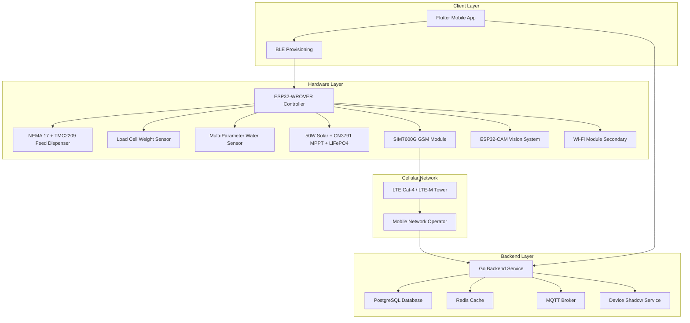

# Smart Fish Feeder System Design Document

## Overview

The Smart Fish Feeder System is a distributed IoT solution designed for Aquaculture 4.0 precision farming, consisting of three main components: an ESP32-WROVER based hardware controller with GSM-primary connectivity, a Flutter mobile application, and a Go backend service. The system provides automated fish feeding with adaptive biological control algorithms, comprehensive monitoring, and data analytics for aquaculture operations.

The architecture follows a GSM-Primary paradigm where the ESP32 controller connects directly to carrier-grade cellular infrastructure, eliminating dependency on local Wi-Fi networks. This design enables deployment in remote aquaculture locations (offshore cages, rural ponds) where terrestrial broadband is unreliable. The system implements Q10 metabolic algorithms, Optimal Behavior Models (OBM), and optional Deep Deterministic Policy Gradient (DDPG) reinforcement learning for Feed Conversion Ratio (FCR) optimization from 1.5-1.8 down to 1.0-1.2.

## Architecture

### System Architecture



### Communication Flow

1. **ESP32 to Backend**: Sensor data, feeding events, system status via MQTT over LTE with Protobuf serialization
2. **Backend to ESP32**: Configuration updates, manual commands via MQTT Device Shadow pattern
3. **Mobile App to Backend**: User requests, configuration changes via REST API with JWT authentication
4. **Backend to Mobile App**: Real-time notifications via WebSocket/Push notifications and Device Shadow synchronization
5. **Provisioning Flow**: BLE ECDH key exchange for secure Wi-Fi/APN credential transfer
6. **Failover Logic**: GSM-Primary with Wi-Fi-Secondary and store-and-forward buffering during outages
7. **Visual Verification**: ESP32-CAM captures feeding videos transmitted via SIM7600G high-bandwidth connection

## Biological Control Algorithms

### Q10 Metabolic Framework

The system implements temperature-dependent feeding adjustments based on the Q10 coefficient, which describes metabolic rate sensitivity to temperature changes. For most cultured species, Q10 values range from 2.0-2.5, meaning metabolic demand roughly doubles for every 10°C temperature rise.

**Mathematical Model:**
```
FR_adj = SFR × (Q10^((T - T_ref)/10)) × Thermal_Inhibition(T)
```

Where:
- `FR_adj`: Adjusted feeding rate
- `SFR`: Standard feeding rate
- `Q10`: Species-specific metabolic coefficient (2.2 for Tilapia)
- `T`: Current water temperature
- `T_ref`: Reference temperature (25°C)
- `Thermal_Inhibition(T)`: Penalty function preventing overfeeding during thermal stress

### Optimal Behavior Model (OBM)

The OBM incorporates dissolved oxygen constraints on fish feeding behavior. Fish reduce foraging activity when metabolic cost of oxygen extraction exceeds energy gain from food.

**Safety Factor Calculation:**
```
F_safe = max(0, (DO_current - DO_lethal)/(DO_optimal - DO_lethal))
```

**Control Logic:**
- DO > 5.0 mg/L: Factor = 1.0 (Normal feeding)
- 3.0 < DO < 5.0 mg/L: Linear reduction
- DO < 3.0 mg/L: Factor = 0.0 (Emergency stop)

### Deep Deterministic Policy Gradient (DDPG) Integration

Advanced controllers utilize reinforcement learning for adaptive feeding optimization:

**State Space**: Dissolved Oxygen, pH, Temperature, Ammonia, Biomass
**Action Space**: Feed rate (kg/hour)
**Reward Function**: Maximize growth while penalizing water quality violations

The quantized Actor network runs inference on ESP32, while the Critic network operates in the cloud for policy updates.

### Fuzzy Logic Control (FLC)

For robust operation without DDPG complexity, Fuzzy Logic Control provides deterministic feeding decisions by mapping continuous inputs to linguistic sets:

**Fuzzy Rule Base (from update.md Table 1):**

| Temperature | Dissolved Oxygen | Turbidity | Feeding Decision | Rationale |
|-------------|------------------|-----------|------------------|-----------|
| Low | Any | Any | Stop | Metabolism too slow for digestion |
| Optimal | High | Low | Maximum | Ideal growth conditions |
| Optimal | Medium | Low | Medium | Safe maintenance feeding |
| High | Low | Any | Stop | High risk of hypoxic stress |
| Optimal | High | High | Low | Fish cannot visually locate feed |

**Linguistic Sets:**
- Temperature: Low (<15°C), Optimal (20-30°C), High (>35°C)
- Dissolved Oxygen: Low (<4 mg/L), Medium (4-7 mg/L), High (>7 mg/L)
- Turbidity: Low (<10 NTU), Medium (10-50 NTU), High (>50 NTU)

**Defuzzification**: Weighted average method with confidence scoring

### Multi-Sensor Fusion

Advanced sensor fusion using Kalman filtering and weighted averaging for robust measurements:

**Fusion Architecture:**
- **Kalman Filtering**: State estimation with process and measurement noise modeling
- **Weighted Averaging**: Sensor quality-based weighting using accuracy, drift, and noise metrics
- **Confidence Calculation**: Multi-factor confidence scoring based on sensor agreement and covariance
- **Health Assessment**: Individual sensor health monitoring with drift detection

**Quality Metrics:**
- Data Quality: "excellent" (>0.9), "good" (>0.7), "fair" (>0.5), "poor" (<0.5)
- Water Quality Index: Normalized composite score (0.0-1.0)
- Feeding Readiness: Real-time feeding suitability assessment

### Computer Vision "Boil Index" Algorithms

ESP32-CAM with quantized YOLOv8n model provides comprehensive feeding verification:

**Boil Index Analysis:**
1. **Pre-feed Baseline**: Measure surface activity before feeding (typically 0.05-0.15)
2. **Active Feed Analysis**: Calculate optical flow magnitude during feeding (0.3-0.9 range)
3. **Post-feed Assessment**: Detect remaining activity after feeding (0.1-0.5 range)
4. **Satiety Detection**: Trigger early cutoff when activity drops below 0.4 threshold

**Mathematical Models:**
```
Optical_Flow_Magnitude = min(1.0, abs(Active_Feed - Pre_Feed) × 2.0)
Surface_Activity_Level = min(1.0, max(0.0, Optical_Flow_Magnitude × 0.8))
Feeding_Efficiency = Active_Feed × (1.0 - Post_Feed × 0.5)
```

**Pellet Detection Algorithm:**
- Color segmentation for pellet identification
- Blob detection with size filtering
- Coverage percentage calculation
- Confidence scoring (>0.95 threshold)

## Components and Interfaces

### ESP32-WROVER Controller (C++)

**Dual-Core Architecture:**
- **PRO_CPU (Core 0)**: Network stack (LwIP), GSM AT commands, SSL/TLS encryption, FreeRTOS scheduler
- **APP_CPU (Core 1)**: Business logic, sensor polling, Q10 algorithms, AccelStepper motor control

**Core Modules:**
- `FeedingController`: Manages scheduled/manual feeding with Q10 adjustments and anti-jam detection
- `SensorManager`: Handles load cell, multi-parameter water sensors with running averages and calibration
- `PowerManager`: Controls solar MPPT, LiFePO4 battery, Deep Sleep modes, and power source switching
- `CommunicationManager`: Handles GSM-primary/Wi-Fi-secondary connectivity with failover state machine
- `ConfigurationManager`: Stores settings in encrypted NVS partition with EEPROM backup
- `DiagnosticsManager`: System health monitoring, StallGuard detection, and error reporting
- `VisionManager`: ESP32-CAM integration for feeding verification and computer vision analysis
- `SecurityManager`: mTLS certificate management, BLE provisioning, and secure element integration
- `Q10Calculator`: Advanced biological algorithms for metabolic rate adjustments
- `BLEProvisioningManager`: Secure Bluetooth Low Energy device setup with ECDH key exchange
- `OfflineSyncManager`: Store-and-forward data buffering with compression and priority queuing

**Key Interfaces:**
```cpp
class DeviceManager {
public:
    void initializeDevice();
    String getDeviceSerial();
    String getDeviceId();
    bool isDeviceBound();
    void enterPairingMode();
    void exitPairingMode();
    bool validateBindingCode(const String& code);
    void enterBLEProvisioningMode();
    bool processECDHKeyExchange(const uint8_t* publicKey);
};

class FeedingController {
public:
    void executeScheduledFeeding();
    void executeManualFeeding(int duration_ms);
    void updateFeedingSchedule(const FeedingSchedule& schedule);
    FeedingEvent getLastFeedingEvent();
    float calculateQ10Factor(float temperature);
    float calculateOBMSafetyFactor(float dissolvedOxygen);
    void executeAntiJamRoutine();
    bool detectStallGuard();
};

class SensorManager {
public:
    float getCurrentWeight();
    float getWeightPercentage();
    float getWaterTemperature();
    float getDissolvedOxygen();
    float getPH();
    float getTurbidity();
    void calibrateSensors();
    SensorReading getRunningAverage(int minutes);
    bool validateSensorData(const SensorReading& data);
};

class CommunicationManager {
public:
    bool connectToGSM();
    bool connectToWiFi();
    bool registerDevice();
    bool authenticateWithBackend();
    void sendSensorData(const SensorReading& data);
    void sendFeedingEvent(const FeedingEvent& event);
    void handleFailover();
    void enterDeepSleep();
    void bufferDataOffline(const uint8_t* data, size_t length);
    void flushOfflineBuffer();
    int getSignalStrength(); // CSQ value
};

class PowerManager {
public:
    void initializeMPPT();
    PowerSource getCurrentPowerSource();
    float getBatteryVoltage();
    int getBatteryPercentage();
    void switchPowerSource(PowerSource source);
    void enterPowerSavingMode();
    void exitPowerSavingMode();
    bool isSolarAvailable();
    void logPowerEvent(PowerSource source, float voltage);
};

class VisionManager {
public:
    bool captureImage();
    bool detectFeedingActivity();
    bool detectUneatePellets();
    float calculateSatietyLevel();
    void sendVideoClip(int durationSeconds);
    bool initializeCamera();
    void processImageWithYOLO(const uint8_t* imageData);
};
```

### Backend Service (Go)

**API Handlers:**
- `AuthHandler`: User registration, login, JWT token management, and password reset
- `DeviceHandler`: Arduino registration, configuration, command endpoints, and device binding
- `FeedingHandler`: Schedule management, feeding history, and analytics
- `MonitoringHandler`: Sensor data collection and real-time status
- `CalculatorHandler`: Feed requirement calculations and recommendations
- `UserHandler`: User profile management, device associations, and preferences

**Core Services:**
- `AuthService`: JWT token validation, user session management, and security
- `DeviceService`: Hardware-to-user association, device ownership verification
- `FeedCalculatorService`: Species-based feeding algorithms
- `Q10CalculatorService`: Advanced biological algorithms with Q10 metabolic models and OBM safety constraints
- `BLEProvisioningService`: Bluetooth Low Energy provisioning with ECDH key exchange and session management
- `OfflineSyncService`: Store-and-forward data synchronization with compression and priority-based retry logic
- `ComputerVisionService`: ESP32-CAM analysis with Boil Index algorithms and feeding verification
- `FuzzyLogicService`: Fuzzy Logic Control for deterministic feeding decisions using linguistic rule base
- `DDPGService`: Deep Deterministic Policy Gradient reinforcement learning for adaptive feeding optimization
- `SensorFusionService`: Multi-sensor data fusion using Kalman filtering and weighted averaging
- `AnalyticsService`: Data aggregation and trend analysis
- `NotificationService`: Alert generation and delivery
- `DeviceManager`: Arduino communication and status tracking

**Repository Layer:**
- `UserRepository`: User data access and management
- `DeviceRepository`: Device data access and binding operations
- `FeedingRepository`: Feeding schedule and event storage
- `SensorRepository`: Sensor data storage and retrieval

### Mobile Application (Flutter)

**Feature Modules:**
- `AuthenticationModule`: User login, registration, JWT token management, and biometric authentication
- `DeviceSetupModule`: BLE provisioning, device pairing, binding, and initial configuration
- `DashboardModule`: Real-time system overview, Q10 status, and quick actions
- `SchedulingModule`: Feeding schedule configuration with biological parameter validation
- `MonitoringModule`: Real-time sensor data, water quality alerts, and video feed viewing
- `CalculatorModule`: Q10-based feed requirement calculator with species-specific parameters
- `AnalyticsModule`: FCR tracking, consumption patterns, and growth rate visualization
- `SettingsModule`: Device configuration, threshold management, and cellular data monitoring
- `DiagnosticsModule`: Signal strength display, battery status, and troubleshooting guides
- `VideoModule`: Feeding verification video playback and computer vision results

## Hardware Implementation

### Microcontroller Architecture

**ESP32-WROVER Selection:**
- **Dual-core Xtensa 32-bit LX6**: 240 MHz processing with dedicated core isolation
- **4MB/8MB PSRAM**: Essential for store-and-forward buffering during network outages
- **Encrypted NVS**: Secure storage for certificates and configuration data
- **Hardware AES**: Accelerated encryption for TLS/mTLS communications

### Mechanical System

**Feed Dispenser:**
- **Mechanism**: Archimedean screw (auger) for precise pellet dispensing
- **Motor**: NEMA 17 stepper motor with 200 steps/revolution precision
- **Driver**: TMC2209 with StallGuard4™ sensorless stall detection
- **Anti-Jam**: Back-EMF monitoring triggers automatic reverse/agitate/retry sequence

**Stall Detection Algorithm:**
```cpp
void FeedingController::executeAntiJamRoutine() {
    if (digitalRead(TMC2209_DIAG_PIN) == LOW) {
        // Stall detected via StallGuard
        stepper.stop();
        stepper.setDirection(REVERSE);
        stepper.runToNewPosition(-180); // Retract 180 degrees
        
        // High-frequency agitation
        for (int i = 0; i < 10; i++) {
            stepper.move(10);
            stepper.runToPosition();
            stepper.move(-10);
            stepper.runToPosition();
        }
        
        // Retry forward motion
        stepper.setDirection(FORWARD);
        jamRetryCount++;
        
        if (jamRetryCount > 3) {
            sendCriticalAlert("FEEDER_JAMMED");
        }
    }
}
```

### Power System

**Solar Architecture:**
- **Panel**: 50W Monocrystalline with weather-resistant mounting
- **MPPT Controller**: CN3791 Maximum Power Point Tracking for 30% efficiency gain
- **Battery**: 12V 12Ah LiFePO4 (2000+ cycle life, thermal stability)
- **Regulators**: 12V→5V Buck (SIM7600), 5V→3.3V LDO (ESP32)

**Power Management:**
```cpp
void PowerManager::switchPowerSource(PowerSource source) {
    switch(source) {
        case SOLAR:
            digitalWrite(SOLAR_ENABLE_PIN, HIGH);
            digitalWrite(BATTERY_ENABLE_PIN, LOW);
            break;
        case BATTERY:
            digitalWrite(SOLAR_ENABLE_PIN, LOW);
            digitalWrite(BATTERY_ENABLE_PIN, HIGH);
            break;
        case DEEP_SLEEP:
            esp_deep_sleep_start();
            break;
    }
    logPowerEvent(source, getBatteryVoltage());
}
```

### Cellular Connectivity

**SIM7600G LTE Cat-4 Module:**
- **Bandwidth**: 150 Mbps DL / 50 Mbps UL for video streaming
- **Power**: 500mA-2A peak (requires bulk capacitance)
- **Sleep Mode**: AT+CSCLK=1 reduces consumption to ~2mA
- **Global Compatibility**: 2G/3G/4G fallback for developing regions

**Communication Protocol Stack:**
- **Transport**: MQTT over TLS 1.2 (Port 8883)
- **Serialization**: Protocol Buffers (60-80% size reduction vs JSON)
- **Security**: mTLS with X.509 client certificates
- **Keep-Alive**: Adaptive 15-minute intervals with PSM/eDRX optimization

## Authentication and Device Binding

### User Authentication Flow

1. **User Registration:**
   - User provides email, password, and basic profile information
   - Backend validates email format and password strength
   - Email verification link sent to user
   - Account activated upon email verification

2. **User Login:**
   - User provides email and password credentials
   - Backend validates credentials and generates JWT tokens
   - Access token (short-lived) and refresh token (long-lived) returned
   - Mobile app stores tokens securely in device keychain

3. **Token Management:**
   - Access tokens expire after 1 hour
   - Refresh tokens expire after 30 days
   - Automatic token refresh when access token expires
   - Secure token revocation on logout

### Device Binding Workflow

1. **Device Registration (First Boot):**
   - Arduino generates unique device ID from hardware serial
   - Device connects to WiFi and registers with backend
   - Backend creates device record with unbound status
   - Device enters pairing mode with LED indicator

2. **Device Pairing Process:**
   - User opens mobile app and selects "Add Device"
   - User enters device serial number (printed on hardware)
   - Backend generates 6-digit binding code with 10-minute expiration
   - User enters binding code on mobile app
   - Backend validates code and binds device to user account

3. **Device Ownership Verification:**
   - All device operations require valid user authentication
   - Backend verifies device ownership before processing commands
   - Device can only be bound to one user at a time
   - Transfer ownership requires unbinding and re-pairing process

4. **Security Measures:**
   - Binding codes expire after 10 minutes
   - Maximum 3 binding attempts per device per hour
   - Device serial numbers are validated against hardware database
   - All API calls include device ownership verification

## Data Models

### Arduino Data Structures

```cpp
struct DeviceConfig {
    char device_serial[32];
    char device_id[64];
    char wifi_ssid[32];
    char wifi_password[64];
    char backend_url[128];
    bool is_bound;
    uint32_t last_sync_timestamp;
};

struct FeedingSchedule {
    uint8_t feeding_count;
    FeedingTime times[MAX_FEEDINGS_PER_DAY];
};

struct FeedingTime {
    uint8_t hour;
    uint8_t minute;
    uint16_t duration_ms;
    uint16_t quantity_grams;
};

struct SensorReading {
    uint32_t timestamp;
    float weight_grams;
    float temperature_celsius;
    uint8_t battery_percentage;
    PowerSource power_source;
};

struct AuthenticationData {
    char device_token[256];
    uint32_t token_expires;
    bool is_authenticated;
};
```

### Backend Models (Go)

```go
// User represents a system user
type User struct {
    ID            uint      `json:"id" gorm:"primaryKey"`
    Email         string    `json:"email" gorm:"uniqueIndex;not null" validate:"required,email"`
    PasswordHash  string    `json:"-" gorm:"not null"`
    FirstName     string    `json:"first_name" validate:"required"`
    LastName      string    `json:"last_name" validate:"required"`
    PhoneNumber   *string   `json:"phone_number,omitempty"`
    CreatedAt     time.Time `json:"created_at"`
    UpdatedAt     time.Time `json:"updated_at"`
    IsActive      bool      `json:"is_active" gorm:"default:true"`
    EmailVerified bool      `json:"email_verified" gorm:"default:false"`
    Devices       []Device  `json:"devices,omitempty" gorm:"foreignKey:UserID"`
}

// Device represents an Arduino fish feeder device
type Device struct {
    ID              uint       `json:"id" gorm:"primaryKey"`
    DeviceID        string     `json:"device_id" gorm:"uniqueIndex;not null"`
    UserID          uint       `json:"user_id"`
    DeviceSerial    string     `json:"device_serial" gorm:"uniqueIndex;not null"`
    Name            string     `json:"name" validate:"required"`
    Location        string     `json:"location"`
    IsActive        bool       `json:"is_active" gorm:"default:true"`
    IsBound         bool       `json:"is_bound" gorm:"default:false"`
    BindingCode     *string    `json:"binding_code,omitempty"`
    BindingExpires  *time.Time `json:"binding_expires,omitempty"`
    LastSeen        time.Time  `json:"last_seen"`
    FirmwareVersion string     `json:"firmware_version"`
    CreatedAt       time.Time  `json:"created_at"`
    UpdatedAt       time.Time  `json:"updated_at"`
    User            User       `json:"user,omitempty" gorm:"foreignKey:UserID"`
}

// DeviceBinding represents temporary device binding codes
type DeviceBinding struct {
    ID           uint      `json:"id" gorm:"primaryKey"`
    DeviceSerial string    `json:"device_serial" gorm:"not null"`
    UserID       uint      `json:"user_id"`
    BindingCode  string    `json:"binding_code" gorm:"uniqueIndex;not null"`
    CreatedAt    time.Time `json:"created_at"`
    ExpiresAt    time.Time `json:"expires_at"`
    IsUsed       bool      `json:"is_used" gorm:"default:false"`
}

// FeedingEvent represents a feeding operation
type FeedingEvent struct {
    ID              uint        `json:"id" gorm:"primaryKey"`
    DeviceID        string      `json:"device_id" gorm:"not null"`
    Timestamp       time.Time   `json:"timestamp"`
    QuantityGrams   float64     `json:"quantity_grams" validate:"min=0"`
    DurationSeconds int         `json:"duration_seconds" validate:"min=0"`
    TriggerType     TriggerType `json:"trigger_type"`
    CreatedAt       time.Time   `json:"created_at"`
}

// SensorData represents sensor readings from Arduino
type SensorData struct {
    ID               uint        `json:"id" gorm:"primaryKey"`
    DeviceID         string      `json:"device_id" gorm:"not null"`
    Timestamp        time.Time   `json:"timestamp"`
    WeightGrams      float64     `json:"weight_grams" validate:"min=0"`
    WeightPercentage float64     `json:"weight_percentage" validate:"min=0,max=100"`
    WaterTemperature float64     `json:"water_temperature"`
    BatteryLevel     int         `json:"battery_level" validate:"min=0,max=100"`
    PowerSource      PowerSource `json:"power_source"`
    CreatedAt        time.Time   `json:"created_at"`
}

// FishSpecies represents fish species feeding parameters
type FishSpecies struct {
    ID                     string             `json:"id" gorm:"primaryKey"`
    Name                   string             `json:"name" validate:"required"`
    FeedingRatePercentage  float64            `json:"feeding_rate_percentage" validate:"min=0,max=10"`
    TemperatureFactor      map[string]float64 `json:"temperature_factor" gorm:"serializer:json"`
    GrowthStages          []GrowthStage      `json:"growth_stages" gorm:"serializer:json"`
    CreatedAt             time.Time          `json:"created_at"`
    UpdatedAt             time.Time          `json:"updated_at"`
}

// AuthToken represents JWT authentication tokens
type AuthToken struct {
    AccessToken  string `json:"access_token"`
    RefreshToken string `json:"refresh_token"`
    TokenType    string `json:"token_type"`
    ExpiresIn    int64  `json:"expires_in"`
}

// Enums
type TriggerType string
const (
    TriggerScheduled TriggerType = "SCHEDULED"
    TriggerManual    TriggerType = "MANUAL"
    TriggerEmergency TriggerType = "EMERGENCY"
)

type PowerSource string
const (
    PowerSolar    PowerSource = "solar"
    PowerElectric PowerSource = "electric"
    PowerBattery  PowerSource = "battery"
)
```
## Correctn
ess Properties

*A property is a characteristic or behavior that should hold true across all valid executions of a system-essentially, a formal statement about what the system should do. Properties serve as the bridge between human-readable specifications and machine-verifiable correctness guarantees.*

### Property Reflection

After analyzing all acceptance criteria, several properties can be consolidated to eliminate redundancy:

- Properties 2.1 and 3.2 (sensor data transmission) can be combined into a single comprehensive sensor data transmission property
- Properties 2.4 and statistical calculations can be consolidated into a general analytics calculation property
- Properties 5.1, 5.2, and 5.3 (power management) can be combined into comprehensive power management properties
- Properties 6.2 and 6.3 (communication and error handling) can be streamlined

### Core Properties

**Property 1: Input validation consistency**
*For any* user input in the mobile app (feeding schedules, fish data, thresholds), the validation logic should consistently reject invalid inputs and accept valid inputs according to defined rules
**Validates: Requirements 1.2, 4.1**

**Property 2: Schedule execution accuracy**
*For any* valid feeding schedule stored in the Arduino controller, when the scheduled time arrives, the system should execute feeding for the exact duration and quantity specified
**Validates: Requirements 1.4, 1.5**

**Property 3: Configuration synchronization**
*For any* configuration change made through the mobile app, the updated parameters should be transmitted to and stored by the Arduino controller within the specified timeout period
**Validates: Requirements 1.3**

**Property 4: Sensor data transmission reliability**
*For any* sensor reading (weight, temperature, battery) collected by the Arduino controller, the data should be transmitted to the backend service and stored with accurate timestamps
**Validates: Requirements 2.1, 3.1, 3.2**

**Property 5: Event logging completeness**
*For any* feeding operation (scheduled or manual), the Arduino controller should create a complete event record with timestamp, quantity, duration, and trigger type
**Validates: Requirements 2.2**

**Property 6: Status display accuracy**
*For any* request for current system status (feed levels, water parameters, device health), the mobile app should display data that matches the most recent sensor readings from the Arduino
**Validates: Requirements 2.3, 3.3**

**Property 7: Analytics calculation correctness**
*For any* set of feeding event data, the backend service should calculate consumption statistics (daily, weekly, monthly, yearly) that accurately sum the recorded feeding quantities for each time period
**Validates: Requirements 2.4**

**Property 8: Threshold-based notifications**
*For any* configured threshold (feed level, water temperature), when sensor readings cross the threshold, the system should generate and deliver notifications to the mobile app within the specified time limit
**Validates: Requirements 2.5, 3.4**

**Property 9: Feed calculation accuracy**
*For any* valid fish population data (species, count, average weight), the feed calculator should produce recommendations that follow species-specific feeding ratios and environmental adjustments
**Validates: Requirements 4.2, 4.4, 4.5**

**Property 10: Power management behavior**
*For any* power availability scenario (solar available, solar insufficient, low battery), the Arduino controller should select the appropriate power source and operating mode according to the defined priority rules
**Validates: Requirements 5.1, 5.2, 5.3**

**Property 11: System recovery consistency**
*For any* power restoration event, the Arduino controller should resume normal operations and synchronize all data that was collected during the offline period
**Validates: Requirements 5.4**

**Property 12: Communication protocol compliance**
*For any* data exchange between system components (Arduino-Backend, Mobile-Backend), the messages should conform to the defined protocol specifications and data format schemas
**Validates: Requirements 7.4**

**Property 13: Manual command execution**
*For any* manual feeding command sent from the mobile app, the Arduino controller should execute the feeding operation immediately and confirm completion within the specified timeout
**Validates: Requirements 6.4**

**Property 14: System diagnostics completeness**
*For any* system startup or diagnostic request, the Arduino controller should test all critical components and report their operational status accurately
**Validates: Requirements 6.1, 6.5**

**Property 15: Authentication token validity**
*For any* API request with authentication tokens, the backend should accept valid tokens and reject expired or invalid tokens consistently
**Validates: Authentication and security requirements**

**Property 16: Device ownership verification**
*For any* device operation request, the backend should verify that the requesting user owns the device before processing the command
**Validates: Device binding and security requirements**

**Property 17: Device binding uniqueness**
*For any* device binding operation, the system should ensure that each device can only be bound to one user at a time and prevent duplicate bindings
**Validates: Device binding requirements**

**Property 18: Q10 metabolic accuracy**
*For any* temperature and species-specific Q10 coefficients, the metabolic factor calculation should correctly implement the Q10^((T-Tref)/10) formula with thermal inhibition constraints
**Validates: Requirements 12, biological control algorithms**

**Property 19: OBM safety factor correctness**
*For any* dissolved oxygen level and species-specific parameters, the OBM safety factor calculation should correctly implement the linear interpolation formula and emergency stop conditions
**Validates: Requirements 12, dissolved oxygen constraints**

**Property 20: Dynamic feed calculator accuracy**
*For any* valid fish population data and environmental conditions, the advanced Fish Feed Calculator Algorithm should produce biologically accurate recommendations using Q10 metabolic adjustments, inverse power feeding rates, and DO penalty factors
**Validates: Requirements 12, 13, advanced biological algorithms**

**Property 21: FCR optimization accuracy**
*For any* biological efficiency parameters, the FCR optimization engine should calculate current FCR, improvement potential, and provide actionable recommendations to achieve the target 1.0-1.2 FCR range
**Validates: Requirements 13, FCR optimization and feeding efficiency**

**Property 22: Computer vision boil index accuracy**
*For any* feeding verification scenario, the computer vision algorithms should accurately calculate Boil Index components, detect satiety levels, and provide reliable feeding activity analysis with appropriate confidence scores
**Validates: Requirements 14, computer vision integration and feeding verification**

## Error Handling

### Arduino Controller Error Handling

**Hardware Errors:**
- Sensor failure detection with fallback to manual operation mode
- Feed dispenser jam detection with automatic retry and user notification
- Power system failures with graceful degradation to essential functions only
- WiFi connectivity loss with local operation and data buffering

**Software Errors:**
- Invalid configuration parameter handling with default value fallback
- Memory overflow protection with circular buffer management
- Watchdog timer implementation for system hang recovery
- EEPROM corruption detection with factory reset capability

### Backend Service Error Handling

**API Errors:**
- Input validation with detailed error messages and field-specific feedback
- Rate limiting with exponential backoff for device communications
- Database connection failures with automatic retry and connection pooling
- Authentication errors with secure token refresh mechanisms

**Data Processing Errors:**
- Malformed sensor data handling with data sanitization and validation
- Calculation overflow protection in feed requirement algorithms
- Concurrent access handling for device configuration updates
- Data consistency validation across distributed components

### Mobile Application Error Handling

**Network Errors:**
- Offline mode with local data caching and sync on reconnection
- API timeout handling with user-friendly retry mechanisms
- Connection quality detection with adaptive data loading strategies
- Background sync failure recovery with user notification options

**User Interface Errors:**
- Input validation with real-time feedback and correction suggestions
- Navigation state recovery after app crashes or interruptions
- Data loading failure handling with manual refresh options
- Push notification delivery failure with in-app message fallback

## Testing Strategy

### Dual Testing Approach

The system will implement both unit testing and property-based testing to ensure comprehensive coverage:

**Unit Tests:**
- Verify specific examples and edge cases for critical functionality
- Test integration points between system components
- Validate error handling scenarios and recovery mechanisms
- Ensure API endpoint behavior matches specifications

**Property-Based Tests:**
- Verify universal properties across all valid input ranges
- Test system behavior under randomly generated scenarios
- Validate mathematical calculations and algorithmic correctness
- Ensure data consistency across component boundaries

### Testing Framework Selection

**Arduino Controller (C++):**
- **Unit Testing:** ArduinoUnit framework for embedded testing
- **Property-Based Testing:** Custom implementation using ArduinoUnit with random input generation
- **Hardware Simulation:** Mock sensor and actuator interfaces for testing without physical hardware

**Backend Service (Go):**
- **Unit Testing:** Go's built-in testing package with testify for assertions
- **Property-Based Testing:** gopter library for property-based test generation
- **Integration Testing:** Go testing with database fixtures and HTTP testing utilities
- **Mocking:** gomock for interface mocking and dependency injection testing

**Mobile Application:**
- **Unit Testing:** Platform-specific testing frameworks (XCTest for iOS, JUnit for Android)
- **Property-Based Testing:** SwiftCheck for iOS, junit-quickcheck for Android
- **UI Testing:** Platform automation frameworks with mock backend services

### Property-Based Testing Configuration

- Each property-based test will run a minimum of 100 iterations to ensure statistical confidence
- Random input generation will be constrained to valid system parameter ranges
- Property tests will be tagged with comments referencing specific design document properties
- Test failures will include the exact input values that caused the failure for debugging

### Test Coverage Requirements

**Arduino Controller:**
- 100% coverage of safety-critical functions (feeding control, power management)
- Hardware abstraction layer testing with simulated sensor inputs
- Communication protocol testing with mock backend responses
- Power failure scenario testing with battery simulation

**Backend Service:**
- 100% coverage of API handlers with various input combinations
- Database operation testing with transaction rollback scenarios
- Calculation algorithm testing with boundary value analysis
- Concurrent access testing with multiple simulated devices using goroutines
- Benchmark testing for performance validation

**Mobile Application:**
- User workflow testing covering all primary use cases
- Backend communication testing with network simulation
- Data synchronization testing with offline/online transitions
- Push notification handling testing with various system states

### Integration Testing Strategy

**End-to-End Testing:**
- Complete user workflows from mobile app through backend to Arduino
- Data flow validation across all system boundaries
- Real-time communication testing with actual hardware when possible
- Performance testing under various load conditions

**Component Integration:**
- Arduino-Backend communication testing with network latency simulation
- Mobile-Backend API testing with authentication and authorization
- Database-Backend integration testing with data migration scenarios
- External service integration testing (push notifications, weather APIs)

The testing strategy ensures that both specific examples work correctly (unit tests) and that general system properties hold across all valid inputs (property-based tests), providing comprehensive validation of system correctness and reliability.